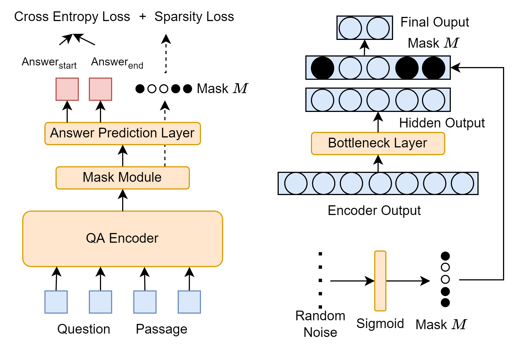

# MDAQA

Pytorch Implementation of the TACL Paper: [Source-Free Domain Adaptation for Question Answering with Masked Self-training](https://direct.mit.edu/tacl/article/doi/10.1162/tacl_a_00669/121543/Source-Free-Domain-Adaptation-for-Question)



Previous unsupervised domain adaptation (UDA) methods for question answering (QA) require access to source domain data while fine-tuning the model for the target domain. Source domain data may, however, contain sensitive information and should be protected. In this study, we investigate a more challenging setting, source-free UDA, in which we have only the pretrained source model and target domain data, without access to source domain data. We propose a novel self-training approach to QA models that integrates a specially designed mask module for domain adaptation. The mask is auto-adjusted to extract key domain knowledge when trained on the source domain. To maintain previously learned domain knowledge, certain mask weights are frozen during adaptation, while other weights are adjusted to mitigate domain shifts with pseudo-labeled samples generated in the target domain. Our empirical results on four benchmark datasets suggest that our approach significantly enhances the performance of pretrained QA models on the target domain, and even outperforms models that have access to the source data during adaptation. 

## Environment Setup

You need to clone our project

```
git clone git@github.com:maxwellyin/MDAQA.git
```

Create the environment and download the packages

```
conda create -n MDAQA python==3.9
conda activate MDAQA
pip install -r requirements.txt
```

## Data Preparation

The datasets utilized for this study are sourced from the [MRQA Shared Task 2019](https://github.com/mrqa/MRQA-Shared-Task-2019), and have been further processed by Yue et al. These processed datasets are available for download [here](https://github.com/xiangyue9607/QVE?tab=readme-ov-file).

Upon downloading the datasets, execute the following command to process the data appropriately:

```
python dataProcess/process.py
```

## Training and Evaluation

Train the base model:

```
cd v2
python base_train.py
```

Adapt to target domain:

```
python adaptation.py
```

Evaluation:

```
python eva.py
```


## Citing 

If you found this repository is helpful, please cite our paper:
```

```
